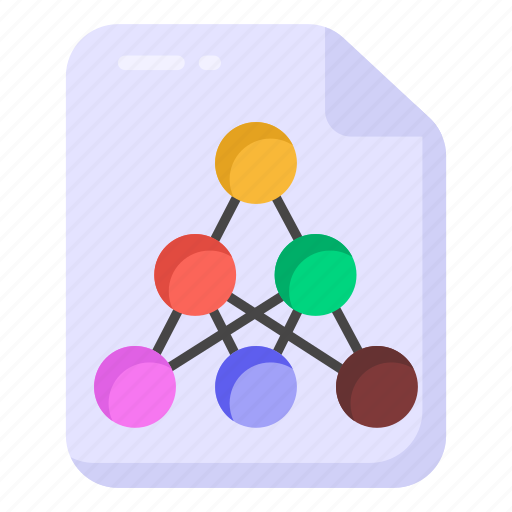
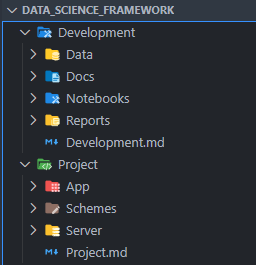
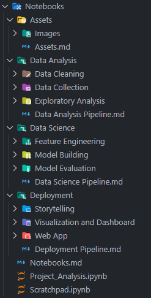
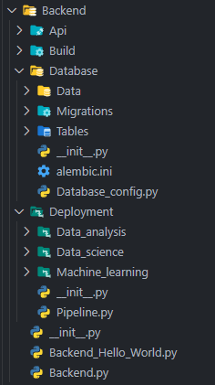
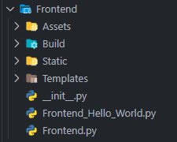

---

# Framework de Ciencia de Datos

##### Leia-me em português <p align="left">  ▶<kbd><a href="https://github.com/AndrewLaganaro/Data_Science_Framework/" alt="Brazilian">  </a></kbd>◀ </p>

##### Readme in English <p align="left"> ▶<kbd><a href="https://github.com/AndrewLaganaro/Data_Science_Framework/blob/main/README.en.md" alt="American"> </a></kbd>◀ </p>

#### [](https://andrewcode.herokuapp.com)

##### Autor: Andrew Laganaro

---

## 📜 Sobre el proyecto

#### Un Framework para proyectos de ciencia de datos, desde el análisis hasta la implementación

> En este repositorio comparto una configuración de carpetas que me ayudó en el desarrollo y análisis de ciencia de datos cuando estaba empezando a aprender sobre el tema
>
> El propósito de esta configuración de carpetas no es solo ser un punto de partida para proyectos de ciencia de datos, sino también una base para una arquitectura de implementación atendida por contenedores, con imágenes de Docker preconfiguradas para cada servicio.

#### 🚀 Construido con
* 🐍Python
* 📘Poetry
* 🔌FastAPI
* 💻Streamlit
* 🪐Jupyter Notebook
* 🐳Docker
* 🖼Drawio

### 🛠 Proyectos

  [](https://github.com/AndrewLaganaro/Store_Sales_Analysis)
  
  [](https://github.com/AndrewLaganaro/Data_Science_Framework)
  
  [](https://github.com/AndrewLaganaro/Data_Science_Classes)

#### ⬇️ Echa un vistazo a mi Portafolio ⬇️
  
  [](https://andrewcode.herokuapp.com)
  
#### 🎯 Estado general del proyecto


Hasta ahora veo el proyecto casi completo, con poca o ninguna duda sobre qué incluir.

Hay archivos dentro llenos con un poco de código destinado a ser los primeros pasos para una canalización de ciencia de datos que aún no se ha finalizado.

#### 📝 Cómo usar este proyecto

##### 💻 Requisitos previos

Antes de empezar, asegúrate de cumplir con los siguientes requisitos:

* Ha instalado la última versión de Python y Cookiecutter.
    * Se requiere al menos Python 3.6.
* Tiene Visual Studio Code para usar iconos de carpetas y archivos

##### 🚀 Instalación del Framework de Ciencia de Datos

Para instalar Data Science Framework, siga los pasos:

* 📁 Seleccione una carpeta en la que desea que esté su proyecto

```
...
📁 Data Science ⬅️ 💻 Inicia aquí tu terminal 💻
    📁 Diamond_Analysis
    📁 Wine_Analysis
    📁 Iris_Analysis
    ...
```

* 💻 Instalar cokkiecutter con pip:

```
pip install cookiecutter
```

* 💻 Luego instala Data Science Framework ejecutando el siguiente comando:

```
cookiecutter https://github.com/AndrewLaganaro/Data_Science_Framework
```

Recibirá algunas preguntas, ingrese la información de su proyecto cuando se le solicite y presione Entrar.

* Se creará una carpeta con el nombre que proporcionó para su proyecto
* Su nombre también estará presente en el archivo principal del cuaderno dentro de la carpeta Cuadernos
* También verá la descripción y el nombre del autor que proporcionó en el archivo README.md del proyecto

```
Project Name [Project Name]: Penguim Dataset

Project Directory [Project folder name]: Penguim Dataset

Author [Your Name]: Daniel

Description [Project Description]: Group different penguim species into groups based on their size and color
```
Independientemente del nombre que dé, los espacios serán reemplazados por guiones bajos y el nombre terminará con "Analysis".

```
...
📁 Data Science
    📁 Diamond_Analysis
    📁 Wine_Analysis
    📁 Iris_Analysis
    📁 Penguim_Dataset_Analysis
    ...
```

##### 🚀🖼 Instalación de configuración de temas de carpetas e iconos

* 💻 Asegúrese de haber instalado [Material Icon Theme](https://marketplace.visualstudio.com/items?itemName=PKief.material-icon-theme) en su VSCode
* 📝 Agregue el contenido del archivo **folder\_file\_icons.json** a su configuración de VSCode **.json**.

```
{
    "otros ajustes":"going around",

    "material-icon-theme.folders.associations": { todas las asociaciones de carpetas },
    "material-icon-theme.files.associations": { todas las asociaciones de archivos },

    "otros ajustes":"going around",
}
```

##### 🖼 **Iconos personalizados para el Material Icon Theme**

* 📁 Crea una carpeta **.vscode/extensions/icons** dentro de tu carpeta de **usuario**
* 📝 No pongas **.svg** al final del nombre del archivo, solo el nombre del icono
* 📁 También puede copiar la carpeta provista que viene con este Framework y usarla como punto de partida
    *  El icono proporcionado actualmente es .pkl de python

```
...
📁 Usuário 💻 Windows, Linux, Mac
    📁 .vscode
        📁 extensions
            📁 icons
                🖼 custom-icon.svg
    📁 Documentos
        📁 Data Science
            📁 Diamond_Analysis
            📁 Wine_Analysis
            📁 Iris_Analysis
    ...
```

#### ☕ Uso del Framework de Ciencia de Datos

Para usar este Framework de Ciencia de Datos, eche un vistazo a las descripciones de las carpetas a continuación.

Para separar el proyecto en las fases de análisis y deploy, la estructura del Framework es la siguiente:

| **Estrutura del Proyecto** |
| ----------------- |
|  |

#### ⚙️🖥 Carpeta Development

* 📊 **Data**
      * Todos los conjuntos de datos, modelos, scalers, clases y objetos encoders utilizados en el proyecto se almacenan aquí.
* 📑 **Docs**
      * La documentación del proyecto va aquí.
* 📚 **Notebooks**
      * Los Notebooks do proyecto va aquí.
* 📈 **Reports**
      * Los informes del proyecto, las visualizaciones y otros resultados emitidos a lo largo del proyecto se encuentran aquí.

| **Carpeta Development** | **Carpeta Notebooks** |
| ------------------ | ---------------- |
|  |  |

### 📊🖥 Carpeta Project

Aquí, el Framework tiene como objetivo implementar el proyecto en un entorno servido por contenedores, como tal, se supone que cada carpeta dentro de ```App``` es un container:

* 🖥📊 **App**
    * 🐳📦 **Backend**
        * Código backend, hacer predicciones, entrenamiento, API con base de datos y frontend
        * También contiene modelos, escaladores, objetos de clase y codificadores
        * Contiene configuración de base de datos, modelo de tabla, esquemas de datos y migraciones
    * 🐳📦 **Frontend**
        * Código frontend, vistas, aplicación web, API con backend
    * 🐳📦 **Database**
        * Código de base de datos, con todos los datos y modelos que se utilizan en el proyecto
    * 🐳📦 **Storage**
        * Container de almacenamiento, con registros, informes, imágenes, etc. Diseñado para pruebas locales.
* 🖼 **Schemes**
    * 🖼🖥 Blueprints para el proyecto, bocetos de API, esquemas de aplicaciones, etc.
* 💿 **Server**
    * 🐳 **Docker**
        * Archivos de Docker compose para desarrollo e implementación
    * ⚙️ **Env**
        * Variables de entorno para el proyecto, principalmente para ser utilizadas con docker compose
    * ⛩ **Heroku**
        * Archivos de configuración de la aplicación Heroku, runtime, requirements, etc.
        * También es posible implementar un contenedor docker en una aplicación heroku usando el archivo Heroku.yml
    * 🐍💿 **Server.py**
        * Código de servidor, destinado a automatizar la implementación con docker

| **Carpeta Project** | **Carpeta Backend** | **Carpeta Server** |
| -------------- | -------------- | ------------- |
|  |  |  |

#### 🛠🖥 Carpeta Build

Aquí es donde construimos los contenedores para el backend y el frontend:

* 🐳📝 **Dockerfile**
    * Dockerfile con configuración mínima para poetry-python
    * Obtene el entorno virtual actual de la carpeta ```/Env``` y docker compose
    * Usar poetry como administrador de dependencias, separando las dependencias según el entorno actual (dev, prod)
    * Uso de un entorno virtual de python con venv
* 🐳⚙️ **Entrypoint.sh**
    * Entrypoint.sh con comandos para ejecutar el proyecto después de la compilación de la build de docker
* 🐍⚙️ **Poetry.lock**
    * Archivo Poetry.lock con todas las dependencias del proyecto enumeradas por versión
* 🐍⚙️ **Pyproject.toml**
    * Archivo Pyproject.toml con dependencias del proyecto separadas por el entorno actual (dev, prod)
* 🐍📝**Requirements.py**
    * Si elige implementar en un container pero no instalar dependencias en la etapa de build, este archivo maneja la instalación de dependencias después de la build cuando se llama a través de entrypoint.sh
* 🐍📝**Requirements.txt**
    * Requirements.txt con las dependencias del proyecto que utilizará Heroku o con requirements.py

| **Carpeta Build** | **Carpeta Frontend** |
| ------------ | --------------- |
|  |  |

#### ⭐️ Funciones por agregar


* [ ] Mejorar este archivo Léame
     * [ ] Comparar un árbol de archivos de texto con los del repositorio, vea cuál se ajusta mejor
     * [ ] Agregar un diagrama hecho con Drawio desde la estructura de carpetas
* [ ] Completar archivos de pipeline de ciencia de datos
* [ ] Complete la configuración del Dockerfile del container de la base de datos 
* [ ] Cree una aplicación web "hola mundo" usando streamlit
* [ ] Crear una API de "hola mundo" usando fastapi
* [ ] Cree una función de ejemplo para la comunicación entre los containers backend y frontend
* [ ] Comprendir mejor cómo usar MySQL o PostgreSQL con Alembic, Pydantic, SQLAlchemy y FastAPI
* [ ] Crear una clase de ejemplo para operaciones CRUD con SQLAlchemy y FastAPI

---

#### ⬇️ Echa un vistazo a mi Portafolio ⬇️
  
  [](https://andrewcode.herokuapp.com)
  