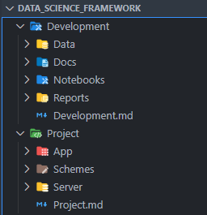
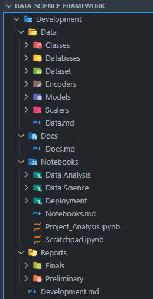
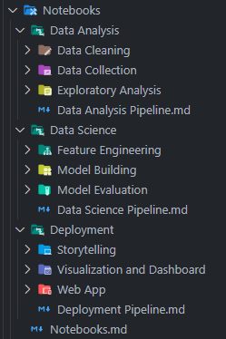
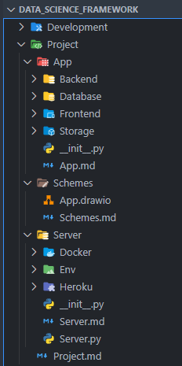
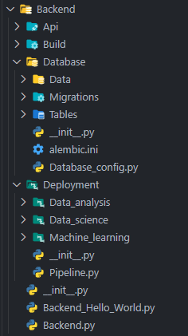
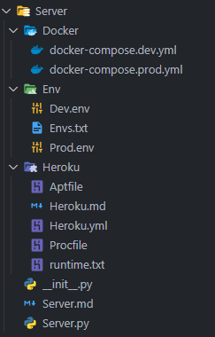
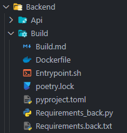
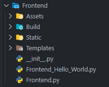

# Data Science Framework


## **About this project**

##### A Framework for Data Science Projects, from analysis to deployment.

>In this repository I share a folder configuration that helped me with data science development and analysis back when I was starting to learn it.
>
>This folder configuration's aim is not only to be a starting point for data science projects but also to be a foundation for a container-served deployment architecture, with pre-configured Docker images for each service.

#### 🚀 **Built with**
- 🐍Python
- 📘Poetry
- 🔌FastAPI
- 💻Streamlit
- 🪐Jupyter Notebook
- 🐳Docker
- 🖼Drawio

#### 🎯**General project status:**


At this point I find it mostly as concluded, with few to no doubts left about what to include in it.
There's files inside filled with some code meant to be the first steps to a data science pipeline that still needs to be finished

#### ⭐️**Features to be added currently are:**


* [ ] Improve this Readme file
    * [ ] Compare a text file tree with the ones in the repo, see which fits better
    * [ ] Add a Drawio diagram of the folder structure
* [ ] Finish data science pipeline files
* [ ] Finish Dockerfile from Database container setup
* [ ] Create a hello world web app using streamlit
* [ ] Create a hello world API using fastapi
* [ ] Create a sample function for communication between backend and frontend containers
* [ ] Better understand how to use MySQL or PostgreSQL with Alembic, Pydantic, SQLAlchemy and FastAPI
* [ ] Create a sample class for CRUD operations with SQLAlchemy and FastAPI

#### 📝**How to use this Project**

#### 💻 Pre-requisites

Before starting, make sure you've met the following requirements:

- You have installed the latest version of Python and Cookiecutter.
    - At least Python 3.6 is required.
- You have either Windows, Linux or Mac machine.

#### 🚀 Installing Data Science Framework

To install the Data Science Framework, follow these steps:

- 📁 Select a folder which you want your project to live in.
```
...
📁 Data Science ⬅️ 💻 Start your terminal here 💻
    📁 Diamond_Analysis
    📁 Wine_Analysis
    📁 Iris_Analysis
    ...
```
- 💻 Install cokkiecutter with pip:

```
pip install cookiecutter
```
- 💻 Then install the Data Science Framework running the following command:

```
cookiecutter https://github.com/AndrewLaganaro/Data_Science_Framework
```
You'll be prompted with some questions, type your project infos as requested and hit enter.

- A folder will be created with the name you provided for your project
- It's name will also be present on the main notebook file inside notebook folder
- You'll also see the description and author name you provided in the README.md file of the project

```
Project Name [Project Name]: Penguim Dataset

Project Directory [Project folder name]: Penguim Dataset

Author [Your Name]: Daniel

Description [Project Description]: Group different penguim species into groups based on their size and color
```
Whatever name you give, spaces will be replaced with underscores and the name will end with "Analysis".
```
...
📁 Data Science
    📁 Diamond_Analysis
    📁 Wine_Analysis
    📁 Iris_Analysis
    📁 Penguim_Dataset_Analysis
    ...
```

#### ☕ Using Data Science Framework
To use this Data Science Framework, take a look at the folder descriptions bellow.

Meant to separate the project into analysis phase and deployment phase, the Framework structure is as follows:

| **Project Structure** |
| ----------------- |
|  |

### ⚙️**Development Folder**

* 📊**Data**
    * Every dataset, model, scaler, classes and encoder object that is used in the project is stored here.
* 📑**Docs**
    * Documentation for the project goes here.
* 📚**Notebooks**
    * Notebooks for the project goes here.
* 📈**Reports**
    * Reports for the project, visualizations and other results issued along the project goes here.

| **Development Folder** | **Notebooks Folder** |
| ------------------ | ---------------- |
|  |  |

### 📊**Project Folder**

Here the structure is aimed to deploy the project in a container-served environment, as such, each folder inside ``` App ``` is meant to be a container:

* 🖥**App**
    * 📦Backend
        * Backend code, predictions, training, API with database and frontend
        * Also contains models, scalers, class and encoder objects
        * Contains database configuration, table model, data schemas and migrations
    * 📦Frontend
        * Frontend code, visualizations, web app, API with backend
    * 📦Database
        * Database code, with all the data and models that are used in the project
    * 📦Storage
        * Storage container, with logs, reports, images, etc Meant for local testing
* 🖼**Schemes**
    * Schemes for the project, API scketchs, App schemes, etc
* 💿**Server**
    * 🐳Docker
        * Docker compose files for development and production
    * ⚙️Env
        * Environment variables for the project, mainly to be used with docker compose
    * ⛩Heroku
        * Heroku app configuration files, runtime, requirements, etc
        * It is also possible to deploy a docker container in a heroku app using Heroku.yml

| **Project Folder** | **Backend Folder** | **Server Folder** |
| -------------- | -------------- | ------------- |
|  |  |  |

### 🛠**Build Folder**

This is where the container is built both to backend and frontend:

* 🔧**Dockerfile**
    * Dockerfile with minimal python-poetry setup
    * Receives current virtual environment from /Env folder and docker compose
    * Using poetry as a dependency manager, separating dependencies according to the current environment (dev, prod)
    * Using a pyhon virtual environment with venv
* ⚙️**Entrypoint.sh**
    * Entrypoint.sh with commands to run the project after docker build
* ⚙️**Poetry.lock/Pyproject.toml**
    * Poetry.lock with the dependencies of the project
    * Pyproject.toml with the project libraries separated by current environment (dev, prod)
* 📝**Requirements.py**
    * If chosen to deploy in a container but not to install dependencies on build stage, this file handles the dependencies installation when being called via entrypoint.sh
* 📝**Requirements.txt**
    * Requirements.txt with the dependencies of the project

| **Build Folder** | **Frontend Folder** |
| ------------ | --------------- |
|  |  |