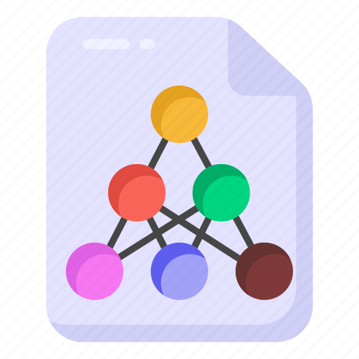

---

# Data Science Framework

##### Readme in English <p align="left"> ▶<kbd><a href="https://github.com/AndrewLaganaro/Data_Science_Framework/blob/main/README.en.md" alt="American"> </a></kbd>◀ </p>

##### Léame en Español <p align="left"> ▶<kbd><a href="https://github.com/AndrewLaganaro/Data_Science_Framework/blob/main/README.es.md" alt="Español"> </a></kbd>◀ </p>

#### [](https://andrewcode.herokuapp.com)

##### Autor: Andrew Laganaro

<<<<<<< HEAD
---
=======
##### Author: Andrew Laganaro

#### [](https://andrewcode.herokuapp.com)

## 📜 About this project
>>>>>>> d64c97a6255082360d2575b98dac4255eba3bd59

## 📜 Sobre este projeto

#### Um Framework para Projetos de Data Science, da análise ao deploy

> Neste repositório eu compartilho uma configuração de pastas que me ajudou no desenvolvimento e análise de ciência de dados quando eu estava começando a aprender sobre o assunto
>
> O objetivo desta configuração de pastas não é apenas ser um ponto de partida para projetos de ciência de dados, mas também uma base para uma arquitetura de implantação servida por containers, com imagens Docker pré-configuradas para cada serviço.

#### 🚀 Construído com
* 🐍Python
* 📘Poetry
* 🔌FastAPI
* 💻Streamlit
* 🪐Jupyter Notebook
* 🐳Docker
* 🖼Drawio

<<<<<<< HEAD
### 🛠 Projetos
=======
### 🛠 Projects

  [](https://github.com/AndrewLaganaro/Store_Sales_Analysis)
  
  [](https://github.com/AndrewLaganaro/Data_Science_Framework)
  
  [](https://github.com/AndrewLaganaro/Data_Science_Classes)

####  ⬇️ Take a look at my Portfolio ⬇️
  
  [](https://andrewcode.herokuapp.com)
  
#### 🎯 General project status
>>>>>>> d64c97a6255082360d2575b98dac4255eba3bd59

  [](https://github.com/AndrewLaganaro/Store_Sales_Analysis)
  
  [](https://github.com/AndrewLaganaro/Data_Science_Framework)
  
  [](https://github.com/AndrewLaganaro/Data_Science_Classes)

####  ⬇️ Dá uma olhada no meu Portfolio ⬇️
  
  [](https://andrewcode.herokuapp.com)
  
#### 🎯 Status geral do projeto


Até aqui vejo o projeto como praticamente concluído, com pouca ou nenhuma dúvida sobre o que incluir.

Há arquivos dentro preenchidos com um pouco de código destinados a serem os primeiros passos para um pipeline de ciência de dados que ainda precisa ser finalizado

#### 📝 Como usar este projeto

##### 💻 Pré-requisitos

Antes de começar, verifique se você atende aos seguintes requisitos:

* Você instalou a versão mais recente do Python e Cookiecutter.
    * É necessário pelo menos o Python 3.6.
* Você tem o Visual Studio Code para usar os ícones de pastas e arquivos

##### 🚀 Instalando o Framework de Data Science

Para instalar o Framework de Data Science, siga os passos:

* 📁 Selecione uma pasta na qual você deseja que seu projeto fique

```
...
📁 Data Science ⬅️ 💻 Inicie o seu terminal aqui 💻
    📁 Diamond_Analysis
    📁 Wine_Analysis
    📁 Iris_Analysis
    ...
```

* 💻 Instale cokkiecutter com pip:

```
pip install cookiecutter
```

* 💻 Em seguida, instale o Data Science Framework executando o seguinte comando:

```
cookiecutter https://github.com/AndrewLaganaro/Data_Science_Framework
```

Você receberá algumas perguntas, digite as informações do seu projeto conforme solicitado e pressione Enter.

* Uma pasta será criada com o nome que você forneceu para o seu projeto
* Seu nome também estará presente no arquivo principal do notebook dentro da pasta do Notebooks
* Você também verá a descrição e o nome do autor que você forneceu no arquivo README.md do projeto

```
Project Name [Project Name]: Penguim Dataset

Project Directory [Project folder name]: Penguim Dataset

Author [Your Name]: Daniel

Description [Project Description]: Group different penguim species into groups based on their size and color
```

Independente do nome que você der, os espaços serão substituídos por underline e o nome terminará com "Analysis".

```
...
📁 Data Science
    📁 Diamond_Analysis
    📁 Wine_Analysis
    📁 Iris_Analysis
    📁 Penguim_Dataset_Analysis
    ...
```

##### 🚀🖼 Instalando a configuração do temas de pastas e ícones

* 💻 Tenha certeza de ter instalado o [Material Icon Theme](https://marketplace.visualstudio.com/items?itemName=PKief.material-icon-theme) no seu VSCode
* 📝 Adicione o conteúdo do arquivo **folder\_file\_icons.json** no **.json** de configuração do seu VSCode.

```
{
    "outras configurações":"going around",

    "material-icon-theme.folders.associations": { todas as associações de pastas },
    "material-icon-theme.files.associations": { todas as associações de arquivos },

    "outras configurações":"going around",
}
```

##### 🖼 **Ícones personalizados para a Material Icon Theme**

* 📁 Crie uma pasta **.vscode/extensions/icons** dentro da sua pasta de **usuário** 
* 📝 Não coloque **.svg** no final do nome do arquivo, apenas o nome do ícone
* 📁 Você também pode copiar a pasta fornecida que vem com este Framework e usá-la como ponto de partida
    *  O ícone fornecido atualmente é para arquivos .pkl do python

```
...
📁 Usuário 💻 Windows, Linux, Mac
    📁 .vscode
        📁 extensions
            📁 icons
                🖼 custom-icon.svg
    📁 Documentos
        📁 Data Science
            📁 Diamond_Analysis
            📁 Wine_Analysis
            📁 Iris_Analysis
    ...
```

#### ☕ Usando o Framework de Data Science

Para usar este Framework de Data Science, dê uma olhada nas descrições das pastas abaixo.

Com o objetivo de separar o projeto em fase de análise e fase de deploy, a estrutura do Framework é a seguinte:

| **Estrutura do Projeto** |
| ----------------- |
|  |

#### ⚙️🖥 Pasta Development

* 📊 **Data**
     * Cada dataset, modelo, scaler, classes e objetos de encoder usados no projeto são armazenados aqui.
* 📑 **Docs**
     * A documentação do projeto vai aqui.
* 📚 **Notebooks**
     * Notebooks do projeto vão aqui.
* 📈 **Reports**
     * Relatórios do projeto, visualizações e outros resultados emitidos ao longo do projeto vão aqui.

| **Pasta Development** | **Pasta Notebooks** |
| ------------------ | ---------------- |
|  |  |

#### 📊🖥 Pasta Project

Aqui a estrutura tem como objetivo dar o deploy do projeto em um ambiente servido por containers, como tal, cada pasta dentro de ```App``` é suposta a ser um container:

* 🖥📊 **App**
    * 🐳📦 **Backend**
        * Código de backend, faz as predições, treinamento, API com banco de dados e frontend
        * Também contém modelos, scalers, objetos de classe e encoders
        * Contém configuração do banco de dados, modelo de tabelas, esquemas de dados e migrações
    * 🐳📦 **Frontend**
        * Código de frontend, visualizações, web app, API com backend
    * 🐳📦 **Database**
        * Código do banco de dados, com todos os dados e modelos que são usados ​​no projeto
    * 🐳📦 **Storage**
        * Container de armazenamento, com logs, relatórios, imagens, etc. Destinado a testes locais
* 🖼 **Schemes**
    * 🖼🖥 Esquemas para o projeto, esboços de API, esquemas de apps, etc
* 💿 **Server**
    * 🐳 **Docker**
        * Arquivos de docker compose para desenvolvimento e deploy
    * ⚙️ **Env**
        * Variáveis ​​de ambiente para o projeto, principalmente para serem usadas com docker compose
    * ⛩ **Heroku**
        * Arquivos de configuração do aplicativo do Heroku, runtime, requirements, etc.
        * Também é possível dar o deploy num container docker em um aplicativo heroku usando o arquivo Heroku.yml
    * 🐍💿 **Server.py**
        * Código do server, destinado a automatizar o deploy com docker

| **Pasta Project** | **Pasta Backend** | **Pasta Server** |
| -------------- | -------------- | ------------- |
|  |  |  |

#### 🛠🖥 Pasta Build

É aqui que o damos o build nos containers para backend e frontend:

* 🐳📝 **Dockerfile**
    * Dockerfile com configuração mínima de python-poetry
    * Recebe o ambiente virtual atual da pasta ```/Env``` e docker compose
    * Usando poetry como gerenciador de dependências, separando as dependências de acordo com o ambiente atual (dev, prod)
    * Usando um ambiente virtual python com venv
* 🐳⚙️ **Entrypoint.sh**
    * Entrypoint.sh com comandos para executar o projeto após a build do docker
* 🐍⚙️ **Poetry.lock**
    * Arquivo Poetry.lock com todas as dependências do projeto listadas por versão
* 🐍⚙️ **Pyproject.toml**
    * Arquivo Pyproject.toml com as dependências do projeto separadas pelo ambiente atual (dev, prod)
* 🐍📝**Requirements.py**
    * Se escolhido o deploy em container mas não instalar as dependências no estágio de build, este arquivo trata da instalação de dependências após a build ao ser chamado via entrypoint.sh
* 🐍📝**Requirements.txt**
    * Requirements.txt com as dependências do projeto a ser usado pelo Heroku ou com requirements.py

| **Pasta Build** | **Pasta Frontend** |
| ------------ | --------------- |
|  |  |

#### ⭐️ Recursos a serem adicionados


* [ ] Melhorar este arquivo Readme
     * [ ] Comparar uma árvore de arquivos em texto com as do repositório, ver qual se encaixa melhor
     * [ ] Adicionar um diagrama feito com Drawio da estrutura de pastas
* [ ] Concluir arquivos de pipeline de ciência de dados
* [ ] Concluir o Dockerfile da configuração do container do banco de dados
* [ ] Criar um aplicativo web de hello world usando streamlit
* [ ] Criar uma API hello world usando fastapi
* [ ] Criar uma função de exemplo para comunicação entre containeres de back-end e front-end
* [ ] Entender melhor como usar MySQL ou PostgreSQL com Alembic, Pydantic, SQLAlchemy e FastAPI
* [ ] Criar uma classe de exemplo para operações CRUD com SQLAlchemy e FastAPI

---

####  ⬇️ Dá uma olhada no meu Portfolio ⬇️
  
  [](https://andrewcode.herokuapp.com)
  